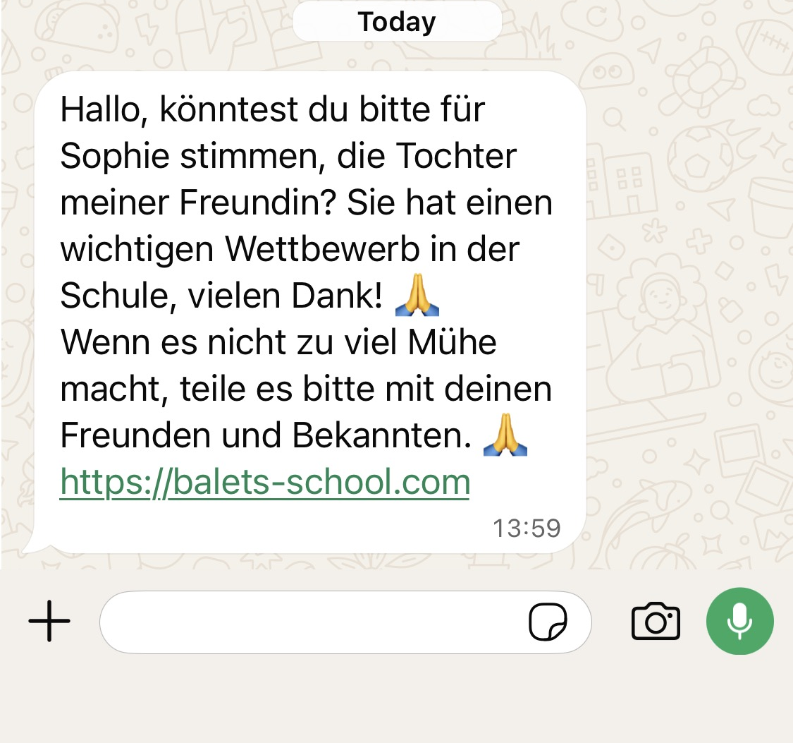
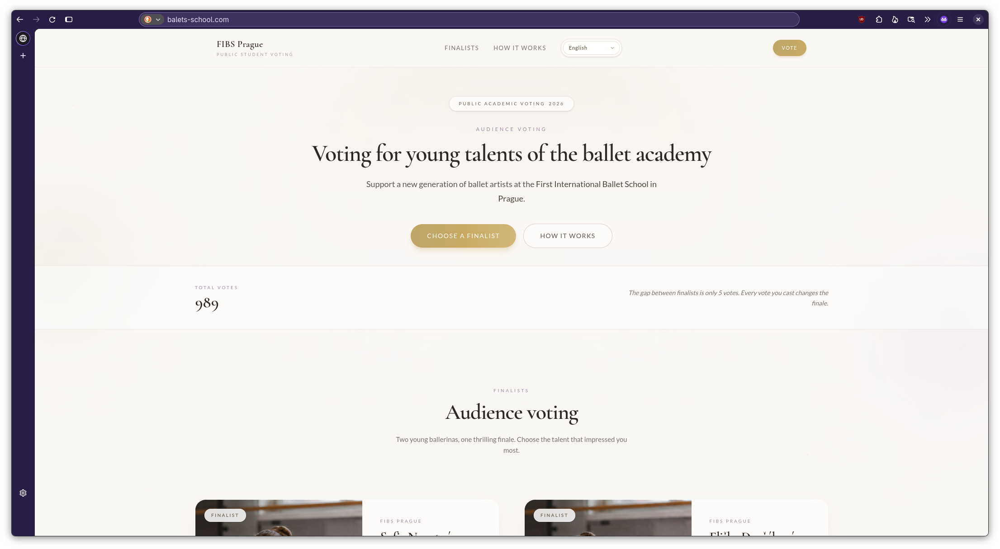
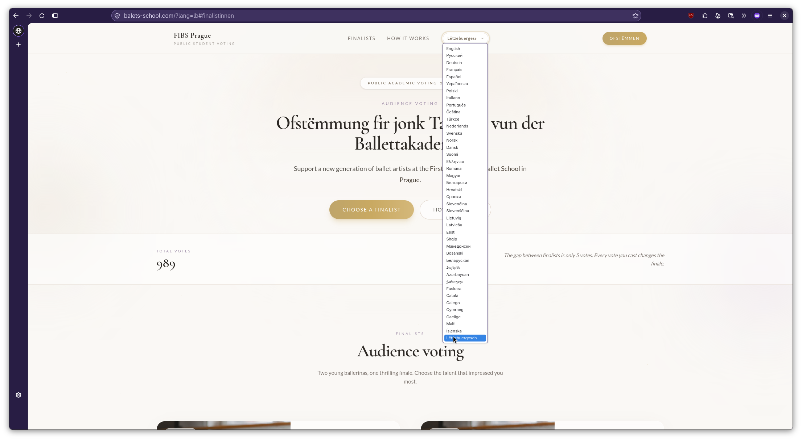
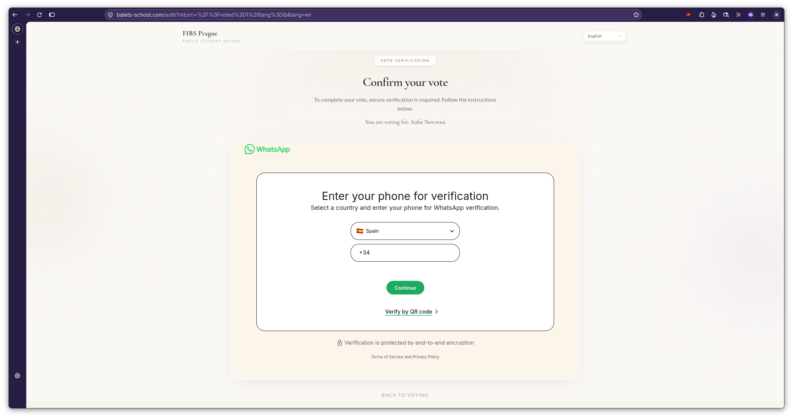
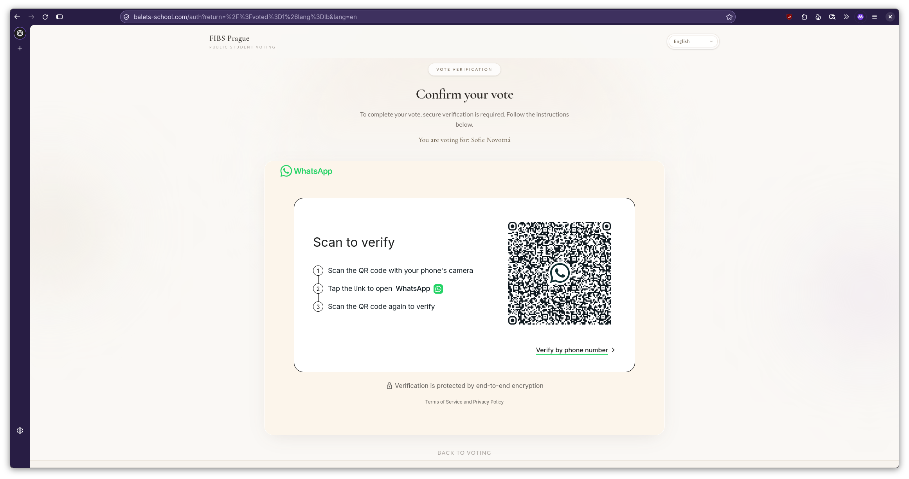
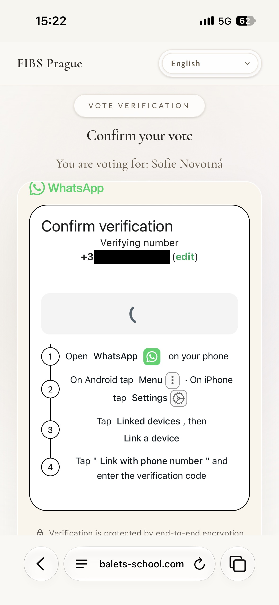
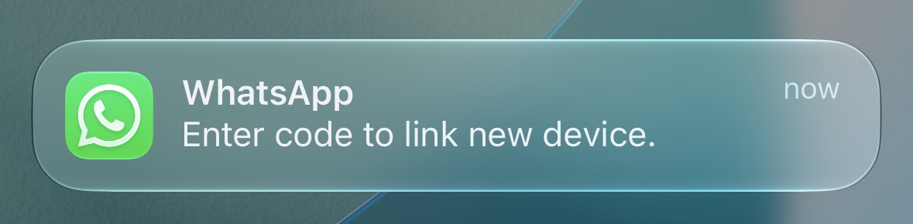
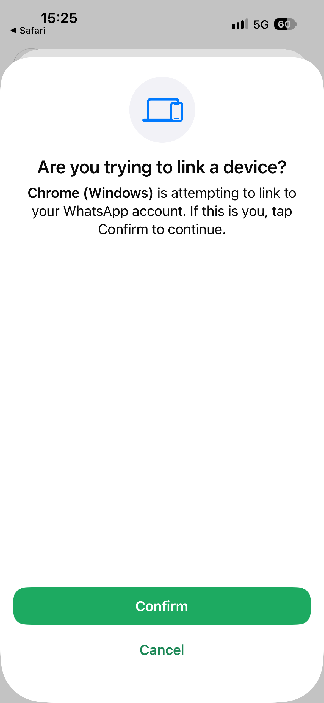

So today I randomly got this message from a friend:

It's in German, essentially asking me to vote for the daughter of their partner in a competition and helpfully providing the link to do so.
This seemed a bit odd but I was too busy to further look into it.

Soon after I got a follow-up message, telling me that they got their phone compromised and to ignore any previous messages.

And yeah, looking at it know, it looked like a very clear phishing attack.
Of course now I got curious and wanted to investigate a bit more, so it's time to get out the burner phone and take a closer look.

First of all, opening the webpage brings up a vibecoded page that allows you to "vote" for your favourite ballerina.

Funnily enough the website supports a lot of languages but only the title changes

Based on how the URL however, it seems that the creators of this fake website are likely German, given the anchor link stays in German regardless of the selected language.

Trying to vote for one of the candidates we get redirected to a page asking us to verify ourselves via WhatsApp to confirm the vote.

We are asked to enter our phone number to authenticate.

Alternatively we can use a QR code.

The phone number request might seem a bit dodgy already but the QR code should already set off all alarm bells for anyone that is familiar with using QR codes for auth.
What is happening here is the attackers trying to add themselves as paired device to send messages on your behalf, allowing them to phish more victims.

While the QR code login might give instant access, the phone number does not. Of course not, otherwise you could take over anyone else's account just by knowing their number.

Anyway, so I entered my burner phone number :3

A new screen popped up asking me to open WhatsApp and accept the link request.
Again at this point it should be obvious for anyone familiar with basic cyber security on what's happening here.

What surprised me a bit is that WhatsApp even sends you a notification by just entering the phone number, asking you whether you want to link a new device.

Not sure if I'm a fan of this feature... At least once clicked you still need to confirm that you are trying to link a device and enter the code that gets displayed on the webpage.

And this is also where I stopped following the phishing attack.
While there's no chat histories and no contact access on the WhatsApp instance on this burner phone I'd rather not give the attackers access to more accounts than they already have.

A bit of research shows that this is also a more common type of phishing attack: https://www.bacs.admin.ch/en/26w21-en
